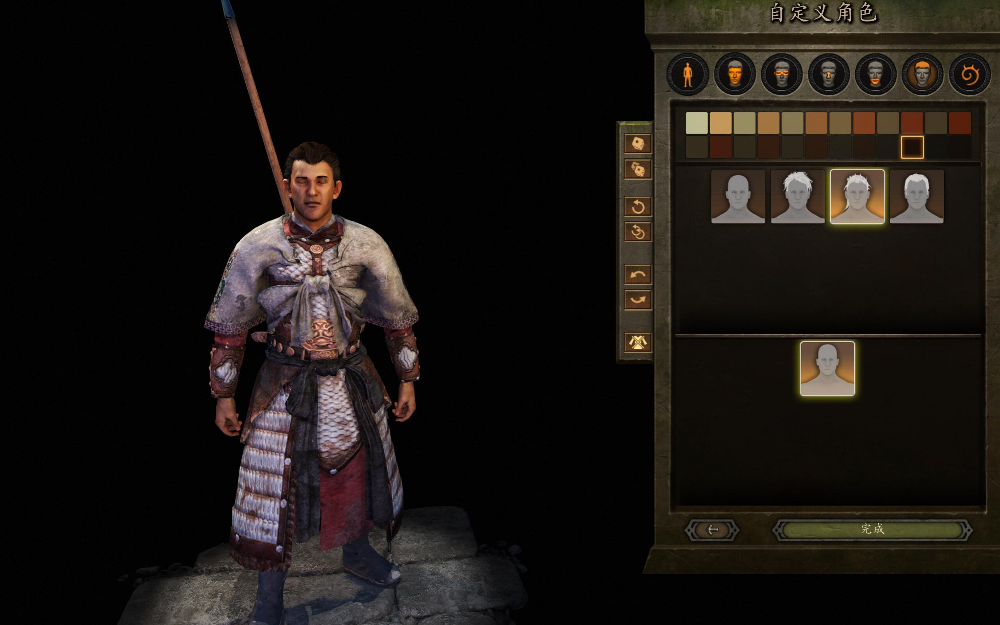

# YiGu - Song Dynasty Armor Mod

[English](README.md) | [中文版](README_CN.md)

## ChangeLog

[2021-06-09] v0.9.0 Release. Known Issue: Helmet not working.

## Introduction

This is an Armor Suit Mod for [Mount & Blade II: Bannerlord](https://www.taleworlds.com/en/Games/Bannerlord). This Mod will add a very fancy armor suit from China Song Dynasty to your inventory. If there is no `Song Dynasty Armor` in your inventory or equipment, this armor suit will be added to your inventory automatically.

## Getting Started

1. Download this repo into `Mount & Blade II Bannerlord/Modules`.
2. Launch the game and click the mod `SongDynastyArmor` and `Harmony`.
3. If you start a new campaign with this mod, please save and reload to see this armor.

## License

This Armor Suit Model is designed by @Aworilri

Copyright © 2021 YiGu Studio.

 This Mod is licensed under a <a rel="license" href="http://creativecommons.org/licenses/by-nc-sa/4.0/">Creative Commons Attribution-NonCommercial-ShareAlike 4.0 International License</a>.

Here is the brief summary for this License:

## Contribute

Thanks for your time! Feel free to open an issue or pull request here.
